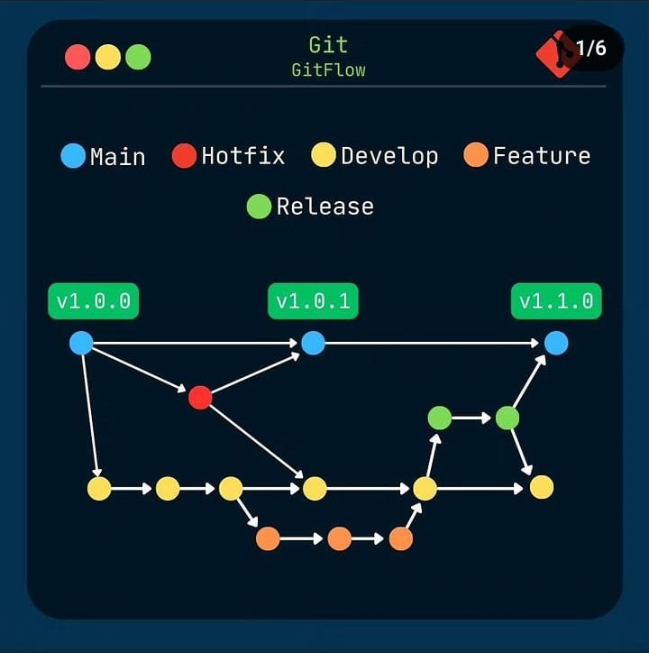
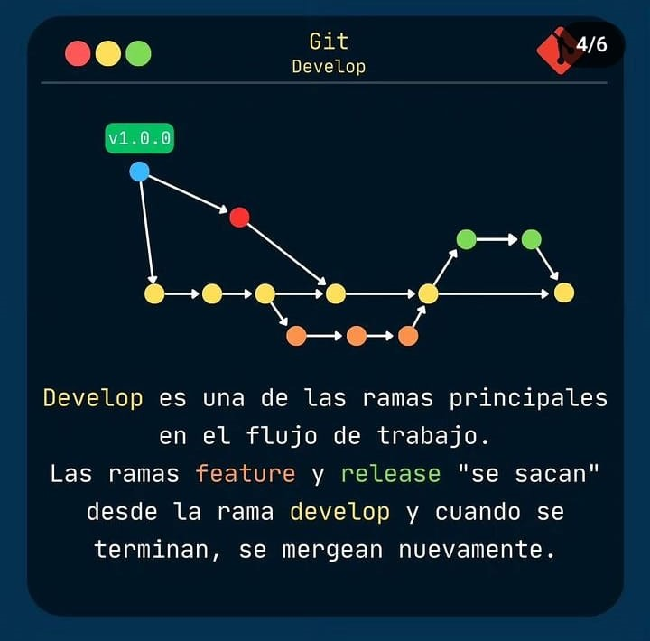

# GitFlow

## **GitFlow for SobreCodigo**

Aquí dejo las anotaciones de dos creadores de contenido que me ayudaron a poder manipular de una manera eficiente las ramas de los futuros trabajos que realizaré. Para ello, te dejo los links por los cual adquirí su contenido. Lo más interesante es la guía de Mizael que, junto a las imágenes explicativas de Gastón, se complementa bien.

creador de contenido:  [Gaston Ortega](https://www.instagram.com/sobrecodigo/ "Gaston Ortega")

 

## Video explicativo por G. Mizael Mtz Hdz

Aprende a cómo trabajar con GitFlow en Gitlab. 
Curso 100% práctico de cómo realizar el manejo de ramas: main/develop/release/hotfix/feature/support/etc.

[GitFlow en Github](https://www.youtube.com/watch?v=LkYWop93S70 "GitFlow en Github")

Para practicar es necesario usar [Visual Code Studio ](https://code.visualstudio.com/ "Visual Code Studio ") y la extensión [Git Graph](https://marketplace.visualstudio.com/items?itemName=mhutchie.git-graph "Git Graph")porque resultará más práctico entender los ejercicios. Luego eres libre de gestionar y practicar como lo desees. Los ejercicios son simples, orientados a cómo se debe gestionar las ramas en cada caso. Se simulará que somos cuatro programadores trabajando en un mismo proyecto de acuerdo a las siguientes condiciones: 

------------

#### **Caso 1**
- **Objetivo:** Implementar inción de sesión de facebook.
- **Rama de trabajo:** feature/login-con-facebook.
- **Rama Origen:** develop
- **Rama Destino:** develop

###### Pasos a seguir: 
Indicamos en consola
- **git checkout -b develop | git pull origin develop** con estas indicaciones, creamos por primera vez la rama (git checkout -b nombre de la rama nueva) o para  traer la rama con la última versión (git pull origin nombreDelaRamaExistente)
- **git checkout -b feature/login-con-facebook** Solicitamos crear nuestra rama donde vamos a trabajar.
- **touch login-con-facebook.txt** Creamos un archivo como si fuera nuestro proyecto nuevo o modificado por el desarrollador para fines prácticos para el ejemplo. Aquí, en una situación real, serían las modificaciones y archivos que agregarías al trabajar en el repositorio local. 
- **git add login-con-facebook.txt** Agregamos los cambios realizados en el nuevo archivo. 
- **git commit -m "Se implementó nuevo inicio de sesión"** Comprometemos el cambio y agregamos el comentario.
- **git push -u origin feature/login-con-facebook**  Y subimos nuestro trabajo a la rama nueva. 

También nos ocupa agregar las modificaciones a la rama pertinente una vez este terminado nuestro desarrollo 

**Repositorio>Pull request>New pull request**

- **base:** develop
- **compare:** feature/login-con-facebook

------------

#### **Caso 2**
- **Objetivo:** Exportar reporte de usuarios a Google drive. 
- **Rama de trabajo:** feature/exportar-report-drive
- **Rama Origen:** develop
- **Rama Destino:** develop

###### Pasos a seguir: 
Indicamos en consola
- **git checkout -b develop | git pull origin develop** 
- **git checkout -b feature/exportar-report-drive**
- **touch exportar-report-drive.txt.** 
- **git add exportar-report-drive.txt** 
- **git commit -m "Soporte para reportes de usuarios a Google drive"** 
- **git push -u origin feature/exportar-report-drive**  

También nos ocupa agregar las modificaciones a la rama pertinente una vez este terminado nuestro desarrollo 

**Repositorio>Pull request>New pull request**

- **base:** develop
- **compare:** feature/exportar-report-drive

------------

#### **Caso 3**
- **Objetivo:** Error de inicio de sesión con Linkedin (v1.1.0). 
- **Rama de trabajo:** hotfix/login-linkeding
- **Rama Origen:** master
- **Rama Destino:** master y develop
###### Pasos a seguir: 

Indicamos en consola
- **git checkout -b main | git pull origin main** 
- **git checkout -b hotfix/login-linkeding** 
- **touch login-linkeding.txt.**  
- **git add login-linkeding.txt**
- **git commit -m "Se soluciona el error al iniciar sesión con Linkedin"** 
- **git push -u origin hotfix/login-linkeding**  

También nos ocupa agregar las modificaciones a la rama pertinente una vez este terminado nuestro desarrollo 

**Repositorio>Pull request>New pull request**

- **base:** main
- **compare:** hotfix/login-linkeding

En local
- **git checkout main  | git pull origin main**
- **git tag -a v1.1.0 -m "version 1.1.0**
- **git push -u origin v1.1.0**

Pull request develop
**base:** develop
**compare:** main
- **git checkout develop | git pull origin develop**: Aquí hay que prestar atención porque es importante llevar los cambios a la rama develop para que los demás desarrolladores tenga disponibles estás modificaciones. No es un paso que deba omitirse. Fijarse en el cuadro para entenderlo mejor. 

------------

#### **Caso 4**
- **Objetivo:** Liberar verision v1.2.0 
- **Rama de trabajo:** release/v1.2.0
- **Rama Origen:** develop
- **Rama Destino:** master y develop

###### Pasos a seguir: 
Indicamos en consola
- **git checkout -b develop | git pull origin develop** 
- **git checkout -b release/v1.2.0**
- **touch ajustes-release/v1.2.0.txt** 
- **git add ajustes-release/v1.2.0.txt** 
- **git commit -m "Ultimos ajustes"** 
- **git push -u origin release/v1.2.0**  

Debemos ingresar los cambios a la rama pertinente>
**Repositorio>Pull request>New pull request**
**base:** main
**compare:** release/v1.2.0

En local
- **git checkout main  | git pull origin main**
- **git tag -a v1.2.0 -m "version v1.2.0**
- **git push -u origin v1.2.0**

Pull request develop
- **base:** develop
- **compare:** main
- **git checkout develop | git pull origin develop**  Aquí hay que prestar atención porque es importante llevar los cambios a la rama develop para que los demás desarrolladores tenga disponibles estás modificaciones. No es un paso que deba omitirse. Fijarse en el cuadro para entenderlo mejor. 

------------

IMPORTANTE.

Entiendo bien que podemos usar los comandos pertinentes como para hacer un merge. Sin embargo, si examinas el vídeo, te percatarás de que los ejemplos son eficaces en un entorno de trabajo en el que hay un jefe de proyecto que examina las modificaciones y desarrollos realizados antes de iniciar la implementación de los mismos. 

