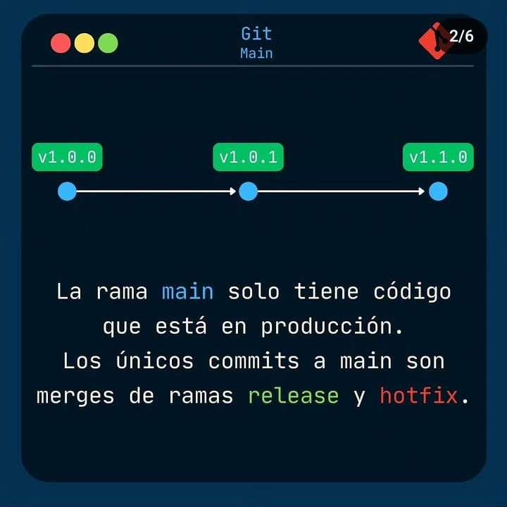
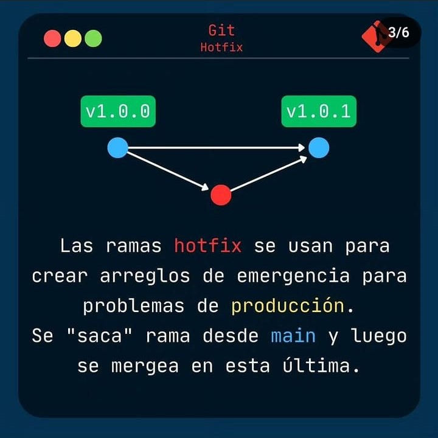
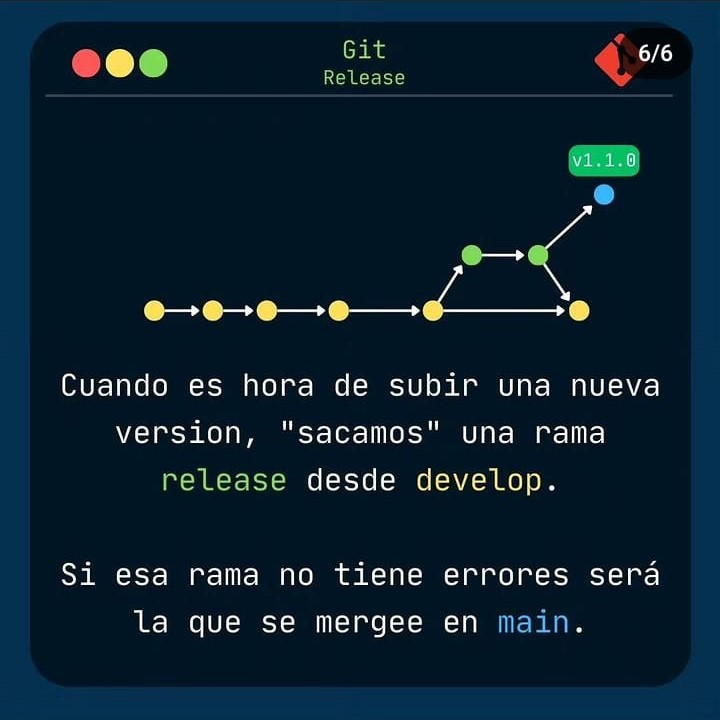

## **GitFlow for SobreCodigo**
creador de contenido:  [Gaston Ortega](https://www.instagram.com/sobrecodigo/ "Gaston Ortega")

## Video explicativo por G. Mizael Mtz Hdz

Aprende a cómo trabajar con GitFlow en Gitlab. 
Curso 100% práctico de cómo realizar el manejo de ramas: main/develop/release/hotfix/feature/support/etc.

[GitFlow en Github](https://www.youtube.com/watch?v=LkYWop93S70 "GitFlow en Github")

Para practicar deben tener [Visual Code Studio ](https://code.visualstudio.com/ "Visual Code Studio ") y la extensión [Git Graph](https://marketplace.visualstudio.com/items?itemName=mhutchie.git-graph "Git Graph"). 
Los ejercicios son simples, orientados simplemente a como se debe gestionar las ramas en cada caso. Se simulara que somos cuatro programadores trabajando en un mismo proyecto de acuerdo a las siguientes condiciones: 

------------

#### **Caso 1**
- **Objetivo:** Implementar inción de sesión de facebook.
- **Rama de trabajo:** feature/login-con-facebook.
- **Rama Origen:** develop
- **Rama Destino:** develop

###### Pasos a seguir: 
indicamos en consola
- **git checkout -b develop | git push -u origin develop** para crear o traer la rama con la ultima version.
- **git checkout -b feature/login-con-facebook** Para crear nuestra rama donde desarrollemos nuestro trabajo. 
- **touch login-con-facebook.txt**  Para crear un archivo cómo si fuera nuestro proyecto nuevo o modificado por el desarrollador. 
- **git add login-con-facebook.txt** Agregamos los cambios realizados en el nuevo archivo. 
- **git commit -m "Se implementó nuevo inicio de sesión"** comprometemos el cambio y agregamos el comentario.
- **git push -u origin feature/login-con-facebook**  Y subimos nuestro trabajo a la rama nueva. 

Debemos ingresar los cambios a la rama pertinente una vez este terminado nuestro desarrollo 

**Repositorio>Pull request>New pull request**

- **base:** develop
- **compare:** feature/login-con-facebook

------------

#### **Caso 2**
- **Objetivo:** Exportar reporte de usuarios a Google drive. 
- **Rama de trabajo:** feature/exportar-report-drive
- **Rama Origen:** develop
- **Rama Destino:** develop

###### Pasos a seguir: 
indicamos en consola
- **git checkout -b develop | git push -u origin develop** 
- **git checkout -b feature/exportar-report-drive**
- **touch exportar-report-drive.txt.** 
- **git add exportar-report-drive.txt** 
- **git commit -m "Soporte para reportes de usuarios a Google drive"** 
- **git push -u origin feature/exportar-report-drive**  

Debemos ingresar los cambios a la rama pertinente

**Repositorio>Pull request>New pull request**

- **base:** develop
- **compare:** feature/exportar-report-drive

------------

#### **Caso 3**
- **Objetivo:** Error de inicio de sesión con Linkedin (v1.1.0). 
- **Rama de trabajo:** hotfix/login-linkeding
- **Rama Origen:** master
- **Rama Destino:** master y develop
###### Pasos a seguir: 

indicamos en consola
- **git checkout -b main | git pull origin main** 
- **git checkout -b hotfix/login-linkeding** 
- **touch login-linkeding.txt.**  
- **git add login-linkeding.txt**
- **git commit -m "Se soluciona el error al iniciar sesión con Linkedin"** 
- **git push -u origin hotfix/login-linkeding**  

Debemos ingresar los cambios a la rama pertinente

**Repositorio>Pull request>New pull request**

- **base:** main
- **compare:** hotfix/login-linkeding

En local
- **git checkout main  | git pull origin main**
- **git tag -a v1.1.0 -m "version 1.1.0**
- **git push -u origin v1.1.0**

Pull request develop
**base:** develop
**compare:** main
- **git checkout develop | git pull origin develop**: debemos actualizar la rama para que los demás usaurios puedan tener las nuevas actualizaciones.

------------

#### **Caso 4**
- **Objetivo:** Liberar verision v1.2.0 
- **Rama de trabajo:** release/v1.2.0
- **Rama Origen:** develop
- **Rama Destino:** master y develop

###### Pasos a seguir: 
indicamos en consola
- **git checkout -b develop | git push -u origin develop** 
- **git checkout -b release/v1.2.0**
- **touch ajustes-release/v1.2.0.txt** 
- **git add ajustes-release/v1.2.0.txt** 
- **git commit -m "Ultimos ajustes"** 
- **git push -u origin release/v1.2.0**  

Debemos ingresar los cambios a la rama pertinente>
**Repositorio>Pull request>New pull request**
**base:** main
**compare:** release/v1.2.0

En local
- **git checkout main  | git pull origin main**
- **git tag -a v1.2.0 -m "version v1.2.0**
- **git push -u origin v1.2.0**

Pull request develop
- **base:** develop
- **compare:** main
- **git checkout develop | git pull origin develop**  debemos actualizar la rama para que los demás usaurios puedan tener las nuevas actualizaciones.

------------

